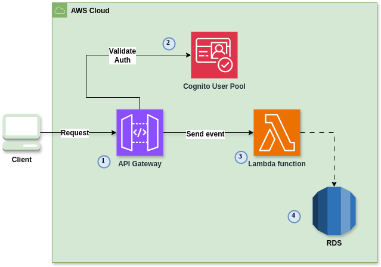
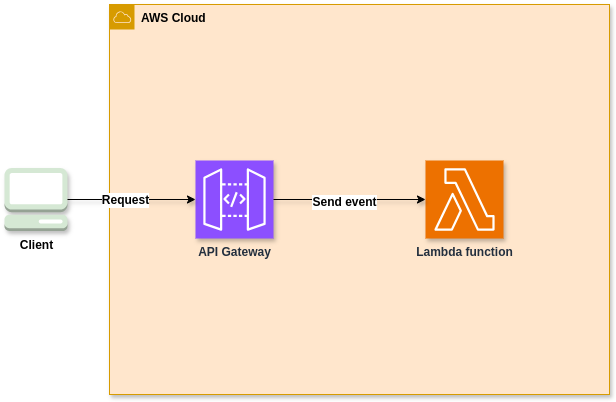

[](https://github.com/auto-deal-cars/auto-deal-api/actions/workflows/deploy.yml)

# AutoDeal API - Uma solução AWS Lambda Docker

Alunos:

* Pedro Henrique de Marins da Silva - RM348617

## O Projeto

Uma empresa de revenda de veículos automotores nos contratou pois quer implantar uma
plataforma que funcione na internet, sendo assim, temos que criar a plataforma. O time de UX já está criando os designs, e ficou sob sua responsabilidade criar a API, para que posteriormente o time de frontend integre a solução. O desenho da solução envolve as seguintes necessidades do
negócio:

- Cadastrar um veículo para venda (Marca, modelo, ano, cor, preço);
- Editar os dados do veículo;
- Permitir a compra do veículo via internet para pessoas cadastradas. O cadastro deve ser feito anteriormente à compra do veículo;
- Listagem de veículos à venda, ordenada por preço, do mais barato para o mais caro;
- Listagem de veículos vendidos, ordenada por preço, do mais barato para o mais caro.

Este proejeto foi gerado com o template `aws-python-docker` do [Serverless framework](https://www.serverless.com/).

Para mais detalhes, por favor, referir para a [documentação](https://www.serverless.com/framework/docs/providers/aws/).

## Infraestrutura



Foi escolhida uma abordagem Serverless para essa solução, utilizando o AWS Lambda para a execução das funções e o AWS API Gateway para a criação das rotas da API.
Esta arquitetura permite o desenvolvimento do código da solução sem a preocupação em gerenciamento de servidores, focando no código da solução.

As funções Lambdas podem ser invocadas a partir de eventos(triggers) para rodar código. No caso das APIs, os triggers serão rotas criadas no nível do API Gateway.



> **Requirements**: Docker. In order to build images locally and push them to ECR, you need to have Docker installed on your local machine. Please refer to [official documentation](https://docs.docker.com/get-docker/).

In order to deploy your service, run the following command

```
sls deploy
```

## Test your service

After successful deployment, you can test your service remotely by using the following command:

```
sls invoke --function hello
```
